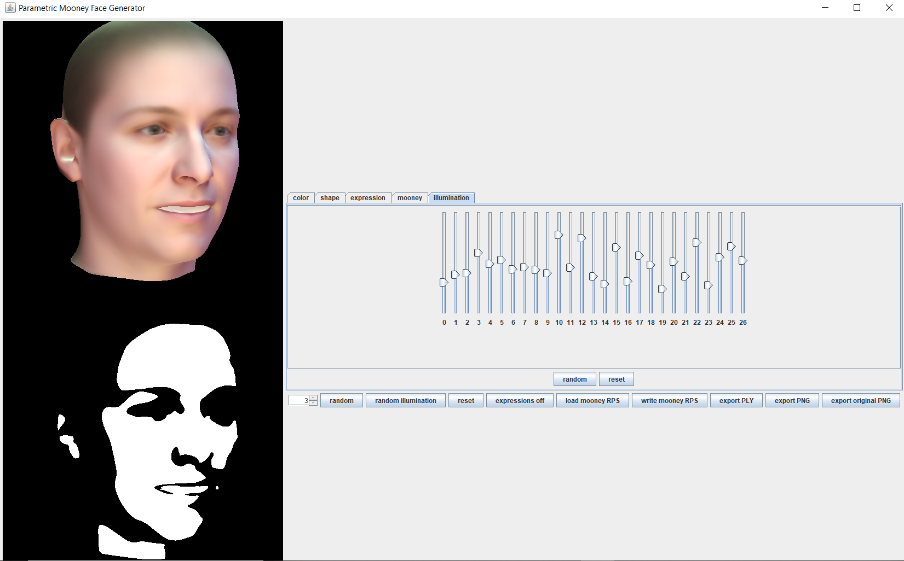

# Parametric Mooney Face Generator

A simple and graphical tool to generate [Mooney faces](https://en.wikipedia.org/wiki/Mooney_Face_Test).
This tool generates Mooney faces using fully synthetic face images from a 3D Morphable Face Model. You get full control over parameters like face shape, color, illumination and pose.
 
 
Learn more about [3D Morphable Models](https://arxiv.org/abs/1909.01815)

## Requirements
- installed [Java](http://www.oracle.com/technetwork/java/javase/downloads/index.html) (Version 8.0 or higher recommended)
- installed [sbt](http://www.scala-sbt.org/release/tutorial/Setup.html) (only for compiling from sources)
- generate a new folder for this project
- download the [Basel Face Model 2019](https://faces.dmi.unibas.ch/bfm/bfm2019.html)
- download the [Basel Illumination Prior 2017](https://gravis.dmi.unibas.ch/PMM/data/bip/)
- move the Basel Illumination Prior to the data directory of your generated folder. There should now be a parameters folder in the data directory.

## Run (precompiled):
- make sure to fulfil all requirements above
- download `mooney-generator.jar` under [release](https://github.com/updown2/parametric-mooney-face-generator/release) and put it in the same folder as the data folder.
- run `java -Xmx2g -jar mooney-generator.jar`
- select the model2019_fullHead.h5 file containing the full head Basel Face Model to start

## Usage:
- upper random and reset button will update color/shape/expression/Mooney/illumination parameters for active tab
- lower reset button will update all model parameters
- lower random button will update all model parameters except mooney parameters
- the button neutralModel will remove the expression part of the model
- the random illumination button will change the illumination to a random one
- the button `load mooney RPS` will load rendering parameters from a .rps file with shape, color, expression, and mooney
- the button 'write mooney RPS' will write the rendering parameters to a .rps file with shape, color, expression, and mooney
- the button `write PLY` enables writing the current instance as a mesh in the ply file format without mooney parameters
- the button `export PNG` enables writing the mooney version of the current instance as an image in the png file format
- the button `export original PNG` enables writing the original current instance as an image in the png file format
- sliders are ordered according to the principal components for shape, color and expressions and spherical harmonics parameters for illumination.
- the maximal parameter value corresponding to the sliders can be adjusted
- press `Ctrl` to move pose with mouse (first click on face to activate the frame)

## For Developers:
- clone repository
- compile and run using `sbt run -mem 2000`

## Maintainer

- Riya Arora <riya@mit.edu>
- Bernhard Egger <egger.bernhard@gmail.com>

This tool was built starting from the [Basel Face Model Viewer](https://github.com/unibas-gravis/basel-face-model-viewer)

## Dependencies
- [scalismo-faces](https://github.com/unibas-gravis/scalismo-faces) `0.9.2+`